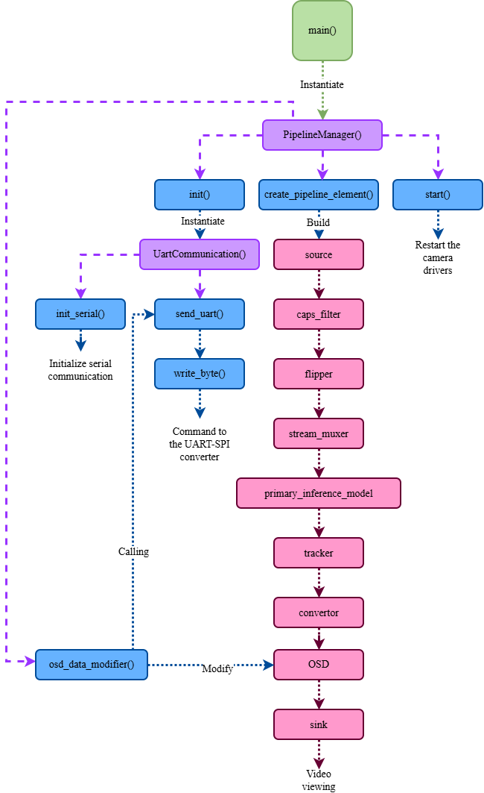

# Computer Vision Pipeline - Jetson Orin Nano Super

A real-time computer vision project for the NVIDIA Jetson Orin Nano Super that combines a final C++ DeepStream application with supporting Python prototypes, YOLOv11s object detection, and multi-object tracking. The project is built on NVIDIA DeepStream, which is a streaming analytics toolkit for AI-powered applications and supports both C/C++ and Python development through GStreamer-based pipelines.  

## Overview

This repository contains the final implementation in `c++_src/App.c++`, along with earlier Python development versions in `python_src/`. The pipeline captures video from a CSI camera, performs accelerated inference, tracks detected objects over time, overlays metadata on the output stream, and can send control commands over UART to an external device.  

The project uses DeepStream as the high-performance video analytics layer and GStreamer as the underlying plugin-based multimedia framework. GStreamer organizes media processing as pipelines made of linked elements, while DeepStream adds optimized plugins for batching, inference, tracking, visualization, and hardware acceleration on Jetson devices.   

## Final Version

The final version of the application is implemented in:

- `c++_src/App.c++`

In the final C++ pipeline, the camera used is the IMX477, a 12 MP Sony CSI sensor commonly used with Jetson platforms through native camera support.   

The Python files are kept as development and testing versions:

- `python_src/main.py`
- `python_src/test.py`

## Main Features

- Real-time video capture from a Jetson-compatible CSI camera.
- Final C++ implementation validated with an IMX477 CSI camera module.
- YOLOv11s-based object detection using a TensorRT engine.
- Multi-object tracking with NVIDIA tracker components.
- On-screen display of detections and tracking metadata.
- UART-based communication with an external controller.
- Mixed-language development flow: Python for prototyping, C++ for the final application.

DeepStream is designed for streaming data coming from CSI cameras, files, or network streams, and provides dedicated plugins for batching, inference, tracking, and visualization. Its core SDK uses accelerators such as VIC and GPU to offload compute-heavy operations for better performance on Jetson platforms.  

## Project Structure

```text
.
├── configs
│   ├── config_tracker_NvDCF_perf.yml
│   ├── config_tracker_NvDeepSORT.yml
│   └── yolo11s_infer.txt
├── c++_src
│   ├── App.c++
│   └── Test.c++
├── c_src
│   ├── libnvdsinfer_custom_impl_Yolo.so
│   └── libnvds_nvmultiobjecttracker.so
├── Makefile
├── models
│   ├── labels_yolov11.txt
│   ├── Tracker
│   │   ├── resnet50_market1501.etlt
│   │   └── resnet50_market1501.etlt_b100_gpu0_fp16.engine
│   ├── yolo11s.onnx
│   └── yolo11s.onnx_b1_gpu0_fp16.engine
├── python_src
│   ├── main.py
│   └── test.py
└── run.sh
```

## Directory Guide

### `configs/`

This folder contains the configuration files for inference and tracking:

- `yolo11s_infer.txt` — DeepStream inference configuration for YOLOv11s.
- `config_tracker_NvDCF_perf.yml` — tracker configuration focused on NvDCF performance.
- `config_tracker_NvDeepSORT.yml` — tracker configuration for DeepSORT-style tracking.

DeepStream provides dedicated plugins for inference and tracking, including `nvinfer` for TensorRT-based inference and `nvtracker` for object tracking. These components are configured externally through project-specific config files such as the ones used here.  

### `c++_src/`

This folder contains the native C++ application code:

- `App.c++` — final application version.
- `Test.c++` — test or experimental C++ version.

DeepStream ships with C/C++ reference applications and explicitly supports custom application development in C/C++. This makes C++ the natural choice for the final optimized version of the pipeline on Jetson.  

### `c_src/`

This folder stores binary libraries used by the pipeline:

- `libnvdsinfer_custom_impl_Yolo.so` — custom YOLO inference parser/plugin library.
- `libnvds_nvmultiobjecttracker.so` — NVIDIA multi-object tracker shared library.

### `models/`

This folder contains the detection and tracking models:

- `yolo11s.onnx` — source ONNX model.
- `yolo11s.onnx_b1_gpu0_fp16.engine` — TensorRT engine optimized for execution on NVIDIA GPU.
- `labels_yolov11.txt` — class label list.
- `Tracker/` — tracker embedding model files based on ResNet50.

DeepStream builds on CUDA and TensorRT, and TensorRT is used to accelerate inference on NVIDIA GPUs. This matches the use of ONNX and TensorRT engine files in this repository.  

### `python_src/`

This folder contains Python implementations used during development:

- `main.py` — Python prototype.
- `test.py` — Python experimental or test version.

DeepStream also supports Python through Gst-Python bindings and probe-based access to metadata inside the pipeline. In practice, this makes Python useful for rapid prototyping, while performance-focused deployments are often finalized in C++.  

### Root Files

- `Makefile` — build rules for the C++ application.
- `run.sh` — helper script for launching the project.

## Pipeline Architecture



## Hardware Requirements

- NVIDIA Jetson Orin Nano Super.
- Jetson-compatible CSI camera, with the final C++ version using an IMX477 module.
- Display connected through HDMI or DisplayPort for local visualization.
- Optional microcontroller or flight/control board connected through UART.
- Suitable power supply for the Jetson platform.

DeepStream is optimized for NVIDIA GPUs and can run on embedded Jetson platforms, while Jetson developer documentation provides the hardware and software basis for deploying such pipelines on Orin Nano devices.  

## Software Requirements

- JetPack installed on the Jetson device.
- NVIDIA DeepStream SDK.
- CUDA toolkit compatible with the DeepStream build.
- GStreamer runtime and development packages.
- C++ compiler with C++17 support.
- Python 3 for prototype scripts.

DeepStream supports Jetson-based deployment and uses a GStreamer-based architecture, while GStreamer itself is a framework for building streaming media applications through a plugin and pipeline model.   

## Build

Build the final C++ application with:

```bash
make
```

The `Makefile` links against GStreamer, GLib, and DeepStream libraries, which is consistent with DeepStream's GStreamer-based application model and its native C/C++ development path.   

## Run

Run the helper script with:

```bash
chmod +x run.sh
./run.sh
```

If needed, you can also execute the prototype Python scripts directly from `python_src/`, but the production-ready implementation in this repository is the C++ version in `c++_src/App.c++`.  

## Development Notes

This repository reflects a migration path from Python prototyping to a final C++ implementation. DeepStream officially exposes both Python and C/C++ paths, but its sample applications and native SDK flow make C/C++ especially suitable for final, performance-oriented deployments on Jetson.  

The Python scripts remain valuable for validating pipeline logic, testing metadata handling, and experimenting with control logic before porting stable functionality into the final C++ application. DeepStream's Python path uses Gst-Python bindings and probe functions to access metadata at different stages of the pipeline.  

## References

- NVIDIA DeepStream Documentation: https://docs.nvidia.com/metropolis/deepstream/dev-guide/ 
- DeepStream Overview: https://docs.nvidia.com/metropolis/deepstream/dev-guide/text/DS_Overview.html 
- GStreamer Documentation: https://gstreamer.freedesktop.org/documentation/ 
- Jetson Orin Nano Developer Kit User Guide: https://developer.nvidia.com/embedded/learn/jetson-orin-nano-devkit-user-guide/index.html 
